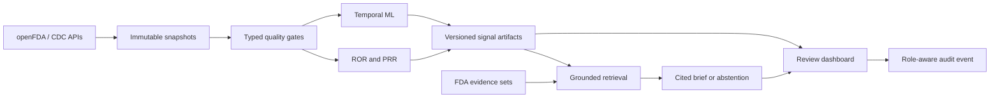

# Portfolio walkthrough

## Sixty-second demonstration

1. Open the signal queue and select **SEMAGLUTIDE — ILEUS**.
2. Explain the ROR confidence interval, report count, and temporal deviation.
3. Show that the priority reasons are inspectable rather than a black-box rank.
4. Open the evidence brief and follow its numbered FDA citations.
5. Select **DEXMEDETOMIDINE — DIABETES INSIPIDUS** to show safe abstention.
6. Review the data-quality gate and leakage-resistant detector comparison.
7. Finish with the production architecture and responsible-use boundary.

All visible data are labeled demonstration records. They illustrate platform
behavior and are not clinical findings or live FDA monitoring.

## Architecture

## Evaluation summary

- Statistical calculations include reference and sparse-table tests.
- Temporal models use fixed seeds and strictly prior history for change scores.
- Backtests use walk-forward splits and report recall@K, precision@K, lead time,
  and alert burden.
- Brief evaluation covers citation availability, unsupported citations,
  unsafe causal language, abstention, and signal-artifact immutability.
- The release suite includes API, CLI, quality, ingestion, analytics, and
  end-to-end demonstration tests.

## Résumé description

Built an evidence-first public-health safety surveillance platform that ingests
versioned openFDA and CDC data, enforces typed quality contracts, calculates
ROR/PRR signals, applies explainable temporal anomaly detection, performs
leakage-resistant backtesting, and generates citation-validated AI evidence
briefs with safe abstention. Delivered through FastAPI and an accessible review
dashboard with lineage, observability, role-aware audit events, CI, SBOM
generation, and reproducible deployment.

