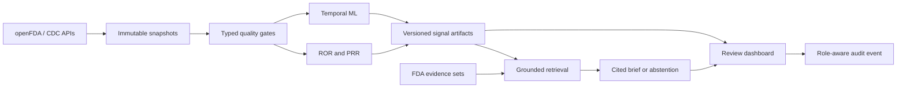

# Portfolio walkthrough

For the full technical and research explanation behind this demonstration, see
the [system design and research guide](system-design-and-research-guide.md).

## Sixty-second demonstration

1. Open the signal queue and select **SEMAGLUTIDE — ILEUS**.
2. Explain the ROR confidence interval, report count, and temporal deviation.
3. Show that the priority reasons are inspectable rather than a black-box rank.
4. Open the evidence brief and follow its numbered FDA citations.
5. Select **DEXMEDETOMIDINE — DIABETES INSIPIDUS** to show safe abstention.
6. Review the data-quality gate and leakage-resistant detector comparison.
7. Finish with the production architecture and responsible-use boundary.

All visible data are labeled demonstration records. They illustrate platform
behavior and are not clinical findings or live FDA monitoring.

## Architecture

## Evaluation summary

- Statistical calculations include reference and sparse-table tests.
- Temporal models use fixed seeds and strictly prior history for change scores.
- Backtests use walk-forward splits and report recall@K, precision@K, lead time,
  and alert burden.
- Brief evaluation covers citation availability, unsupported citations,
  unsafe causal language, abstention, and signal-artifact immutability.
- The release suite tests the API, CLI, quality checks, ingestion, analytics,
  and complete demonstration workflow.

## Implementation summary

The software ingests versioned openFDA and CDC data, applies typed quality
checks, calculates ROR and PRR, detects temporal anomalies, and evaluates the
methods with walk-forward backtesting. Evidence briefs are checked for source
citations and return an abstention when the available material is insufficient.
FastAPI and the dashboard expose saved results, their analytical history, data
quality, and review audit events.
