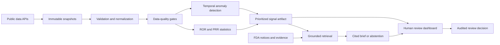

# OpenSignal PH: purpose, novelty, users, and workflow

This page is the short conceptual introduction. The
[system design and research guide](system-design-and-research-guide.md)
contains the complete technical design, current implementation status, and
prioritized remaining work.

## Executive summary

OpenSignal PH is a public-health safety-surveillance platform that helps
analysts find adverse-event reporting patterns that may deserve expert review.
Its first use case is public FDA Adverse Event Reporting System (FAERS) data.

The platform does **not** diagnose patients, determine whether a medicine
caused an event, estimate how frequently an event occurs, or recommend
treatment. It is an early-warning and review-prioritization system.

Its central question is:

> Among many thousands of voluntarily reported medicine-event combinations,
> which patterns changed enough to deserve careful human investigation, and
> what evidence should a reviewer inspect first?

## Why it was made

Spontaneous adverse-event reporting systems contain valuable safety
observations, but they are difficult to use responsibly:

- the number of possible medicine-event combinations is very large;
- reports may be duplicated, incomplete, delayed, or influenced by publicity;
- high report counts do not automatically mean high risk;
- statistical alerts can be unstable when counts are small;
- machine-learning ranks can be difficult to explain;
- generative AI can create unsupported statements or false certainty;
- an analyst must be able to reproduce how a result was produced.

OpenSignal PH was made to demonstrate how these problems can be addressed in
one transparent, reproducible platform. It combines data engineering,
statistical pharmacovigilance, temporal machine learning, evaluation,
responsible AI, human review, and production operations.

It was also designed as a portfolio project aligned with public-sector data
science and computer-science roles, including platform-oriented work at the
CDC. It demonstrates not only model development, but also the infrastructure,
quality controls, documentation, APIs, testing, and responsible-use boundaries
needed to operate analytical systems.

## Primary use case

A pharmacovigilance or public-health analyst receives a new quarterly FDA
adverse-event snapshot. OpenSignal PH:

1. retrieves a bounded, reproducible dataset;
2. validates, deduplicates, and normalizes reports;
3. measures data quality before analysis;
4. calculates established disproportionality statistics;
5. detects unusual changes across reporting periods;
6. compares detectors using time-aware historical backtesting;
7. creates a prioritized review queue;
8. retrieves relevant FDA evidence;
9. creates a citation-constrained brief or explicitly abstains;
10. records the analyst's review decision in an audit trail.

The output is a review priority—not a medical conclusion.

## What is novel about it

Individual parts of the project are not new by themselves. FAERS dashboards,
ROR/PRR calculations, anomaly-detection models, and retrieval-augmented
summaries already exist. The novelty is the way OpenSignal PH combines them
into one evidence-first, safety-constrained, reproducible workflow.

### 1. Statistical and ML agreement is visible

The dashboard shows conventional ROR/PRR evidence beside temporal anomaly
signals. Machine learning can raise a review priority, but it cannot overwrite
the statistical evidence or declare causality.

### 2. AI is separated from the safety decision

AI is used only after a signal has been calculated. It can summarize retrieved
evidence, but it cannot alter scores, thresholds, or review status. Every
factual claim must cite an available source. If citations are missing,
invented, or unsafe language is detected, the system fails closed to an
explicit abstention.

### 3. Data quality is treated as a product output

Completeness, validity, uniqueness, freshness, rejected records, and lineage
are visible to reviewers. The platform does not hide quality checks inside log
files.

### 4. Evaluation respects time

Historical detector comparisons use walk-forward evaluation. A model is only
trained on information that would have existed before the quarter being
evaluated, reducing temporal leakage.

### 5. Every important result is reproducible

Source manifests, immutable snapshots, model settings, random seeds, criteria
versions, timestamps, artifact locations, and SHA-256 digests are saved.

### 6. The platform is reusable across datasets

The ingestion, checkpoint, storage, quality, API, observability, and audit
contracts can support other public-health sources. A CDC wastewater adapter
demonstrates reuse without forcing unrelated datasets into the same scientific
model.

## How it works

### Stage 1: ingestion

Versioned manifests define the source, query, page size, and maximum number of
records. Downloads are checkpointed, so an interrupted run can resume.
Retrieved pages are immutable and content-addressed.

### Stage 2: validation and curation

Typed contracts validate incoming records. Later follow-up reports supersede
earlier versions. Exact duplicates and rejected records are recorded.
Medicine names, drug roles, reactions, dates, and seriousness fields are
normalized into analysis-ready records.

### Stage 3: statistical detection

The system builds report-level contingency tables and calculates:

- Reporting Odds Ratio (ROR);
- Proportional Reporting Ratio (PRR);
- confidence intervals;
- minimum-case and stability criteria.

These statistics identify disproportionate reporting, not causal risk.

### Stage 4: temporal machine learning

Quarterly features include report volume, growth, seriousness, and historical
deviation. A seeded Isolation Forest detects unusual multivariate patterns,
while a robust change score compares the current quarter only with prior
history. Explanations show which features were unusual.

### Stage 5: backtesting

Walk-forward evaluation compares counts, ROR, PRR, and ML rankings with a
versioned FDA reference set. Metrics include recall at K, precision at K,
median lead time, and alert burden.

### Stage 6: evidence briefing

Relevant FDA documents are retrieved deterministically. The default provider
creates an offline template brief. An optional OpenAI provider can generate a
structured brief. Both paths must satisfy the same citation and safety
validation rules.

### Stage 7: human review and operations

The dashboard presents the queue, trends, confidence intervals, prioritization
reasons, citations, uncertainty, data quality, and model evaluation. Review
writes are role-gated and appended to a digest-chained audit log. The API also
provides health, readiness, request identifiers, structured logs, and metrics.

## Who benefits

### Public-health and pharmacovigilance analysts

They receive a smaller, explainable review queue with evidence, uncertainty,
quality information, and reproducible lineage.

### Epidemiologists and safety scientists

They can inspect statistical criteria and temporal behavior without treating
an ML rank as a clinical conclusion.

### Data scientists

They can compare statistical and machine-learning approaches using
leakage-resistant evaluation and operationally realistic artifacts.

### Data and platform engineers

They receive reusable ingestion, checkpointing, validation, storage, API,
observability, audit, CI, and recovery patterns.

### Public-health leadership

They gain a transparent demonstration of how analytical automation can reduce
review effort while preserving human accountability.

### Job reviewers and technical interviewers

They can evaluate a complete system spanning data engineering, statistics, ML,
responsible AI, backend development, interface design, testing, and operations.

## Who can use it

The current release is appropriate for:

- researchers working with public, de-identified surveillance data;
- public-health analysts exploring reproducible signal-detection methods;
- pharmacovigilance teams evaluating workflow concepts;
- data-science and engineering students;
- hiring teams reviewing the system as a technical portfolio project.

It is **not** ready for unsupervised clinical or regulatory use. A real
institutional deployment would require validated source coverage, governed
terminology, identity-provider integration, managed durable storage, security
review, privacy assessment, clinical governance, and formal model validation.

## Example user story

An analyst sees a medicine-event pair marked **Priority review**. The dashboard
shows that the ROR confidence interval exceeds the statistical threshold and
that the latest quarterly count is unusual relative to prior history. The
analyst opens the evidence brief, follows the FDA citations, reviews the
uncertainty statement, checks data quality, and records an escalation for
clinical assessment.

The correct interpretation is:

> This reporting pattern deserves more investigation.

The incorrect interpretation is:

> This medicine caused the event or has been proven unsafe.

## AI and ML responsibilities

| Component | Permitted role | Prohibited role |
|---|---|---|
| ROR/PRR | Measure disproportionate reporting | Establish causality or incidence |
| Temporal ML | Rank unusual changes for review | Replace statistical or clinical judgment |
| Evidence retrieval | Find potentially relevant sources | Decide whether a signal is true |
| Generative AI | Summarize retrieved evidence with citations | Change scores, give treatment advice, or make causal claims |
| Human reviewer | Interpret evidence and record a decision | Treat an automated alert as proof |

## Current data and deployment status

The hosted dashboard uses clearly labeled, realistic demonstration records so
the review workflow can be examined safely and consistently. The repository
contains the working Python ingestion, quality, scoring, temporal ML,
backtesting, briefing, API, testing, and operations code.

The included synthetic end-to-end demonstration can regenerate statistical
scores, temporal ML artifacts, and a cited evidence brief without downloading
the full FAERS dataset. Live institutional monitoring would require a separately
hosted API, scheduled governed ingestion, persistent storage, and approved
access controls.

## Success criteria

OpenSignal PH succeeds when it:

- reduces the number of patterns an expert must inspect;
- explains why each pattern was prioritized;
- exposes limitations and data quality;
- preserves exact analytical lineage;
- measures whether ML improves ranking;
- never allows generated text to alter the detector decision;
- abstains when evidence is insufficient;
- keeps final interpretation and accountability with qualified humans.
