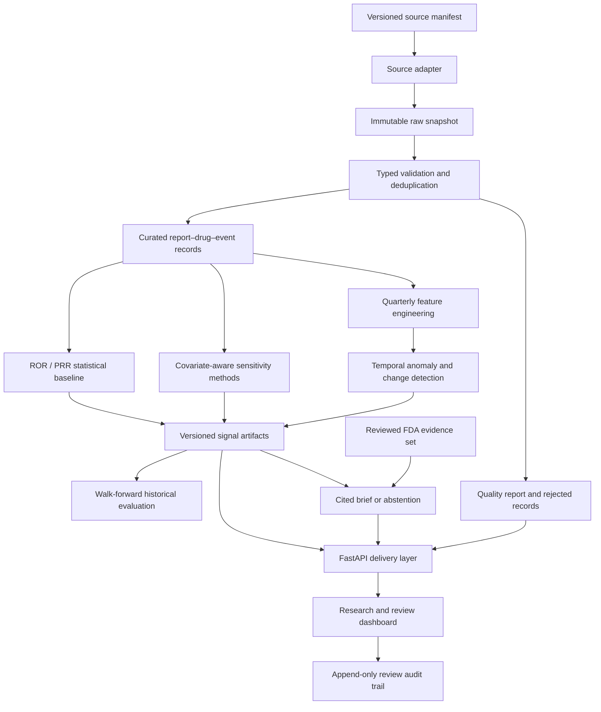

# OpenSignal PH system design and research guide

## 1. What the system is

OpenSignal PH is a surveillance and research platform for finding
adverse-event **reporting patterns** that may deserve expert review.
Its primary use case is the FDA Adverse Event Reporting System (FAERS), a
spontaneous reporting system containing reports submitted by patients,
clinicians, manufacturers, and others.

In plain language, the platform:

1. collects a reproducible snapshot of public reports;
2. checks and cleans the reports;
3. looks for medicine-event pairs reported more often than expected;
4. looks for unusual changes over time;
5. tests whether measured demographic or comparator differences change the
   result;
6. ranks patterns for human review;
7. shows the evidence, uncertainty, data quality, and analytical history;
8. optionally prepares a citation-constrained evidence brief.

The output means **“investigate this reporting pattern”**. It does not mean
**“this medicine caused this event.”**

## 2. The problem it addresses

FAERS is valuable for early detection because it can contain observations that
are uncommon, unexpected, or not fully characterized at approval. However,
spontaneous reports have important weaknesses:

- there is no reliable denominator for the number of exposed patients;
- the same case may be submitted or updated more than once;
- publicity and regulatory attention can stimulate reporting;
- missing age, sex, indication, exposure duration, and comorbidity are common;
- medicine names and adverse-event descriptions vary;
- severe or novel events may be preferentially reported;
- a large report count can reflect use volume rather than elevated risk;
- temporal association alone does not establish causation.

A useful surveillance tool must therefore do more than display counts. It must
make data quality, uncertainty, comparison groups, time, reproducibility, and
human accountability visible.

## 3. Intended users and use cases

### Pharmacovigilance and public-health analysts

Use the review queue to identify drug-event combinations that warrant deeper
case review, literature review, label review, or referral to a safety expert.

### Epidemiologists and safety researchers

Compare crude, stratified, adjusted, active-comparator, and sparse-data
estimates; inspect subgroup heterogeneity; and export reproducible artifacts
for follow-up analyses.

### Data scientists

Develop and evaluate temporal or anomaly-detection methods against statistical
baselines using time-aware backtesting and a fixed alert burden.

### Data and platform engineers

Reuse the manifest, ingestion, checkpoint, immutable storage, validation,
lineage, API, observability, and audit patterns for other public-health data.

### Educators, students, and hiring teams

Examine a complete public-health data product rather than an isolated notebook:
source acquisition, data contracts, statistics, ML, responsible AI, APIs,
testing, operations, documentation, and deployment boundaries.

### Example research workflow

A researcher selects a medicine, adverse event, period, population subgroup,
and comparator strategy. The system shows:

- report counts and the complete 2×2 table;
- crude ROR and PRR with uncertainty;
- age/sex/year strata and heterogeneity;
- Mantel–Haenszel, penalized, and hierarchical sensitivity estimates;
- quarterly trajectory and anomaly features;
- missingness and quality indicators;
- provenance for every generated artifact;
- exportable results for independent verification.

The researcher decides whether the finding deserves a stronger study using
claims, electronic health records, registries, or another longitudinal source.

## 4. What is distinctive

OpenSignal PH does not claim to invent disproportionality analysis, FAERS
exploration, anomaly detection, or evidence summarization. Existing regulatory
and commercial pharmacovigilance systems provide many of those functions.

The contribution is the integrated, inspectable system design:

- **Statistics and ML are compared, not blended into an unexplained score.**
- **Crude and covariate-aware sensitivity estimates appear together.**
- **Temporal evaluation prevents the model from learning from the future.**
- **Data quality is a visible result, not a hidden preprocessing detail.**
- **Every released artifact carries its input and configuration lineage.**
- **Generative AI is downstream from detection and cannot change a signal.**
- **Unsafe or uncited summaries fail closed to abstention.**
- **The same platform contracts support another public-health source while
  preserving source-specific scientific schemas.**
- **A historical benchmark is built from versioned official quarterly files
  and independently reviewed terminology mappings.**

This makes the project particularly relevant to platform-oriented public-sector
data science: it focuses on whether analysis can be trusted, repeated,
operated, and reviewed—not only whether a model can be trained.

## 5. System design



### 5.1 Acquisition

Each run begins with a versioned manifest rather than an ad hoc query. The
manifest fixes the source, search expression, page size, maximum records, and
snapshot identity. Retrieval is bounded, retry-aware, checkpointed, and
idempotent.

For historical work, an additional manifest lists official FDA quarterly ASCII
ZIP archives. Downloads stream to a partial file, enforce a size ceiling,
validate ZIP integrity, and record SHA-256, byte count, retrieval time, and
available HTTP provenance. An existing archive is reused only if its lock still
matches.

### 5.2 Storage and lineage

The conceptual data layers are:

| Layer | Purpose |
|---|---|
| Raw | Preserve exact source payload and retrieval metadata |
| Validated | Retain structurally accepted records and explicit rejection reasons |
| Curated | Normalize the scientific analysis grain |
| Analytics | Store statistics, features, model results, and evaluations |
| Evidence | Store reviewed documents and citation metadata |
| Operations | Store quality, run, review, and audit information |

Artifacts are versioned and carry digests of important inputs. Released
snapshots are not silently overwritten.

### 5.3 Validation, deduplication, and normalization

Typed source contracts allow expected missing values while still rejecting
structurally unusable records. For FAERS:

- the highest report version is retained for a case;
- older follow-ups and exact duplicates are classified explicitly;
- standardized substance or generic names are preferred when available;
- drug role and reaction terms are normalized;
- age group, sex, reporting period, and seriousness are retained;
- accepted, superseded, duplicate, and rejected counts are reported.

Unknown demographic values remain explicit instead of disappearing through
complete-case filtering.

### 5.4 Data-quality gates

Quality checks cover completeness, validity, uniqueness, freshness, volume,
rejection rate, and artifact integrity. Quality results are available through
the API and dashboard. A failed critical gate must stop analytical release
rather than produce a polished-looking result from unfit data.

### 5.5 Statistical signal detection

For a drug `D` and event `E`, the platform constructs:

| | Event E | Other events |
|---|---:|---:|
| Reports containing drug D | a | b |
| Reports containing other drugs | c | d |

It calculates:

- reporting odds ratio (ROR);
- proportional reporting ratio (PRR);
- confidence intervals;
- minimum-case and stability rules.

These describe disproportionate reporting within the database. They do not
estimate incidence, prevalence, relative risk among exposed patients, or
causal effect.

### 5.6 Covariate-aware sensitivity analysis

The current measured adjustment variables are age group, sex, and calendar
year. The platform provides:

- subgroup-specific ROR and PRR;
- approximate heterogeneity assessment;
- Mantel–Haenszel adjusted ROR;
- L2-penalized report-level logistic adjustment;
- an optional reviewed active-comparator analysis;
- empirical hierarchical Beta-Binomial shrinkage.

The comparison is intentionally transparent:

```text
Crude ROR
Age/sex/year-adjusted ROR
Active-comparator ROR
Penalized reporting OR
Hierarchically shrunk reporting OR
```

Differences help identify sensitivity to measured demographics, comparison
group, sparse counts, or subgroup imbalance. Adjustment does not repair
unmeasured confounding, missing clinical history, selective reporting, or the
lack of an exposure denominator.

### 5.7 Temporal ML

Quarterly features include report volume, reporting share, growth,
serious-report proportion, ROR, PRR, and prior-history deviations.

- A seeded Isolation Forest ranks unusual multivariate combinations.
- A median/MAD change detector measures deviation from a pair's prior history.
- Explanations show which features contributed to unusualness.

ML is a prioritization layer. It does not label a medicine as safe or unsafe,
and it cannot override the statistical result.

### 5.8 Historical evaluation

Walk-forward evaluation simulates what was knowable at each historical
quarter. Models and transformations use only earlier periods. Counts, ROR,
PRR, adjusted methods, and ML receive the same alert budget so comparisons do
not reward a detector simply for producing more alerts.

Reference outcomes come from FDA quarterly potential-signal publications.
They are useful external markers but are not a complete gold standard or proof
of causality. Product and event mappings must be independently reviewed before
they become eligible for scoring.

Metrics include:

- recall at K;
- precision at K;
- median lead time;
- alert burden;
- unmatched reference coverage;
- performance and stability by quarter.

### 5.9 Evidence retrieval and generative AI

AI is optional and isolated from signal calculation. The system first retrieves
approved evidence, then asks either a deterministic template or an LLM to
produce a structured brief. Validation requires citations to available
sources, prohibits unsupported causal or treatment claims, and emits an
explicit abstention when requirements are not met.

An OpenAI API key is needed only for the optional OpenAI brief provider. A
ChatGPT account is not required to use the statistical, ML, API, dashboard, or
template-brief components.

### 5.10 API, dashboard, and human review

FastAPI serves saved artifacts without silently recalculating them. The
dashboard presents the review queue, trends, uncertainty, detector
explanations, adjusted sensitivity estimates, quality, evidence, and lineage.

The portfolio deployment uses demonstration records and must stay visibly
labeled as such. Review decisions are role-gated and appended to a
digest-chained audit trail. In a real deployment, trusted request headers and
filesystem artifacts must be replaced by identity-provider claims and managed
durable storage.

### 5.11 Multi-source platform boundary

The CDC wastewater adapter demonstrates reuse of ingestion, checkpointing,
storage, validation, quality, and API conventions. It does not reuse the FAERS
drug-event analytical schema. The reusable asset is the platform contract; the
scientific model remains appropriate to each source.

## 6. How automation and tracking work

The system is automated **within an explicitly selected manifest and
schedule**. It does not automatically know which dataset, time period, or
scientific question should be analyzed.

| Concern | Tracking mechanism |
|---|---|
| What was requested | Versioned manifest and snapshot ID |
| What was received | Immutable raw page/archive plus retrieval metadata |
| Interrupted runs | Page checkpoints or partial quarterly archive |
| Duplicate reruns | Idempotency and digest verification |
| What passed validation | Accepted/rejected artifacts and quality report |
| How a score was made | Detector, criteria version, counts, features, and parameters |
| Which model was used | Seed, hyperparameters, feature schema, and artifact digest |
| What evidence was used | Versioned evidence set and citations |
| Who reviewed a signal | Actor, role, timestamp, decision, and chained audit digest |
| What changed between releases | Git history and versioned artifact metadata |

A production scheduler could run after every official quarterly release. The
safe sequence is ingest, validate, enforce quality gates, curate, score,
evaluate, publish, and notify reviewers. Scientific configuration changes
require review and a new version rather than silent automatic adoption.

## 7. Interpretation and safety boundaries

### Permitted claims

- “This drug-event pair is reported disproportionately in this snapshot.”
- “The reporting pattern changed unusually relative to prior quarters.”
- “The estimate is sensitive to age/sex/year adjustment.”
- “This pair should be prioritized for expert review.”
- “The detector agreed with an FDA-published reference under this protocol.”

### Prohibited claims

- “The medicine caused the event.”
- “The event occurs at this rate among treated patients.”
- “The medicine is safe or unsafe.”
- “The model discovered a confirmed adverse reaction.”
- “Adjustment eliminated all confounding.”
- “Agreement with FDA proves the detector is clinically superior.”

The tool is not a patient-facing diagnostic system, treatment recommender,
causal inference engine, or replacement for regulators and safety scientists.

## 8. Current implementation status

Implemented:

- reproducible openFDA and CDC Socrata ingestion;
- immutable raw snapshots and checkpoints;
- typed validation, deduplication, normalization, and quality reports;
- ROR and PRR scoring;
- temporal Isolation Forest and median/MAD change detection;
- walk-forward evaluation contracts;
- citation-constrained evidence briefs and abstention;
- API, dashboard, lineage, observability, and review audit;
- demographic stratification, Mantel–Haenszel adjustment, penalized logistic
  adjustment, active-comparator support, and hierarchical shrinkage;
- governed longitudinal-data contract;
- official 2024–2025 quarterly FAERS acquisition manifest;
- checksum-tracked quarterly downloader;
- unverified FDA reference seed and review-eligibility rules.

Not yet complete:

- the complete independently reviewed FDA reference set;
- parsing and reconciliation of a real quarterly ASCII pilot;
- the full eight-quarter historical benchmark;
- validated live-data scheduling and persistent production deployment;
- a governed claims/EHR causal validation study;
- formal clinical, regulatory, security, and accessibility validation.

## 9. Remaining work and recommended priority

### Priority 1 — Finish the real historical benchmark

This is the highest-value scientific improvement.

1. Download one bounded 2024 Q1 quarterly archive.
2. Implement and test the ASCII table parser and cross-table joins.
3. Reconcile table counts, follow-up handling, dates, and drug-event grain.
4. Transcribe every FDA reference row for 2024–2025.
5. Have a second reviewer approve terminology mappings without seeing model
   rankings.
6. Freeze the protocol, detector settings, exclusions, and alert budget.
7. Process all eight quarters and publish results, uncertainty, failures, and
   unmatched coverage.

### Priority 2 — Improve researcher usability

- query builder for medicine, event, period, subgroup, and comparator;
- searchable signal detail page with cohort and denominator definitions;
- downloadable analysis package containing data dictionary, configuration,
  methods, results, quality, and lineage;
- saved research workspaces and reproducible analysis URLs;
- missingness and subgroup visualization;
- side-by-side crude/adjusted/comparator sensitivity view;
- terminology-mapping review screen with dual-review workflow;
- plain-language methods tooltips and an advanced methods drawer;
- clear empty, insufficient-data, and abstention states.

### Priority 3 — Strengthen statistical validation

- validated uncertainty for penalized estimates using bootstrap or a fully
  specified Bayesian model;
- multiplicity-aware prioritization such as false-discovery or empirical-null
  diagnostics, used carefully because surveillance prioritization differs from
  confirmatory hypothesis testing;
- time-to-onset, dechallenge/rechallenge, reporter type, geography, and
  seriousness sensitivity analyses where data quality permits;
- negative and positive controls;
- alternative comparison populations and indication-aware designs;
- calibration, stability, and drift reporting by quarter;
- expert-reviewed threshold and alert-capacity analysis.

### Priority 4 — External validation

- reproduce selected published signals with a preregistered protocol;
- compare results with another spontaneous-reporting source where licensing
  and terminology allow;
- connect governed claims or EHR data for new-user active-comparator studies;
- add propensity-score balance, overlap, outcome validation, censoring,
  negative controls, and sensitivity analyses;
- involve a pharmacovigilance or epidemiology reviewer.

### Priority 5 — Production hardening

- managed object storage and relational operational metadata;
- workload identity, secrets management, and real role-based access;
- orchestrated quarterly pipelines with approval gates;
- schema-change detection and source reconciliation alerts;
- artifact catalog, retention enforcement, backups, and disaster exercises;
- dependency, container, privacy, threat-model, and accessibility review;
- service-level objectives, alerting, and cost monitoring.

## 10. Practical success measures

The project should be judged on more than model accuracy:

- percentage of source records with traceable lineage;
- quality-gate failure and reconciliation rates;
- percentage of reference mappings independently reviewed;
- recall at a fixed expert-review capacity;
- alert burden and rank stability across quarters;
- change between crude and adjusted estimates;
- citation correctness and abstention rate;
- time required for an analyst to understand and triage a signal;
- reproducibility of a released result from its manifest;
- number and severity of unresolved governance or accessibility findings.

## 11. Repository reading order

1. `README.md` — setup and phase commands.
2. `docs/system-design-and-research-guide.md` — complete system explanation.
3. `docs/architecture.md` — component boundaries.
4. `docs/adjusted-methods.md` — covariate-aware methods.
5. `docs/historical-benchmark-protocol.md` — real-data evaluation protocol.
6. `docs/operations.md` — deployment, audit, retention, and recovery.
7. `docs/decisions/` — why important design choices were made.
8. `docs/portfolio-walkthrough.md` — concise system demonstration flow.
